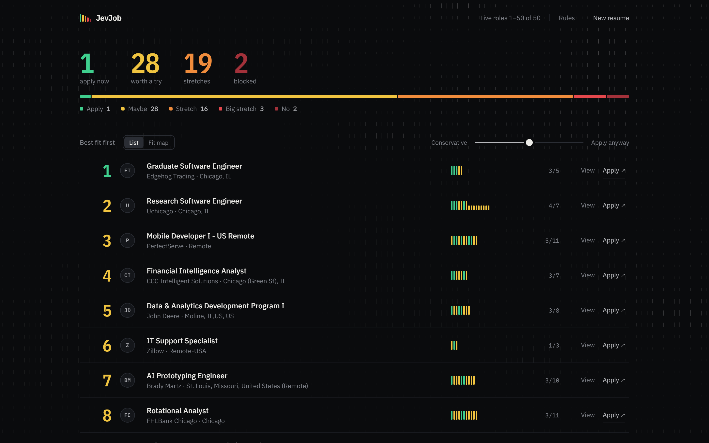
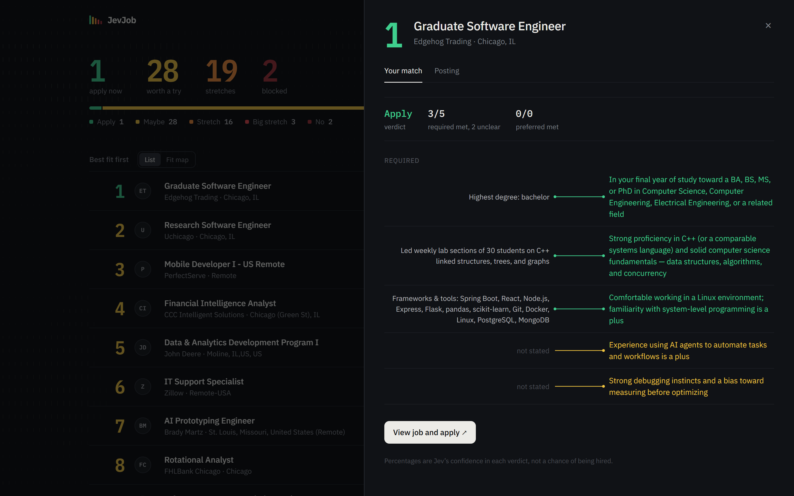

<div align="center">

# JevJob

**Ask your AI assistant for jobs. Get them ranked against your resume, one requirement at a time.**

[](https://github.com/adnanrules/jevjob/actions/workflows/ci.yml)
[](https://github.com/adnanrules/jevjob/tags)
[](LICENSE)

Works inside **Claude Desktop** and **Codex**.



</div>

You type *"junior software engineer in Chicago, last 30 days"* in Claude or Codex. JevJob finds live postings on
employers' own career sites, reads every requirement in each one, and checks it against your resume. You get a ranked
list in five tiers, with every requirement marked green, yellow or red.

- 🟢 **Apply** · 🟡 **Maybe** · 🟠 **Stretch** · 🔴 **Big stretch** · 🟥 **No**. The color of the rank number is the tier.
- **See why.** Each requirement sits next to the resume line that proves it, or shows that nothing does.
- **Real postings, direct links.** Straight from employers' systems (Workday, Greenhouse, Lever, Ashby, Oracle,
  iCIMS, and more), plus the Indeed plugin if you have it. Apply links go to the company, not a job board.
- **One slider** from *Conservative* to *Apply anyway* re-ranks instantly, with no AI calls.
- **Never a "chance of being hired."** JevJob reports which requirements you meet, and how sure it is.

<div align="center">

</div>

## Set it up (about 10 minutes)

You need:
- [Node.js](https://nodejs.org) 20 or newer (the LTS download is fine).
- [Git](https://git-scm.com/downloads).
- [Claude Desktop](https://claude.ai/download) or [Codex](https://developers.openai.com/codex).
- An API key for **Jev**, the model JevJob uses. Step 2 shows where to get one.

### 1. Download and install

Open a terminal (on Windows: PowerShell) and run:

```bash
git clone https://github.com/adnanrules/jevjob.git
cd jevjob
npm install
npm run setup
```

`npm run setup` checks your install, creates a `.env` file for your key, and prints the exact settings for step 4,
already filled in with this folder's location. Keep that output handy.

### 2. Get a Jev key

Pick **one**:

| | Where | Best if |
|---|---|---|
| **A. TypeSafe** (Jev's maker) | [console.typesafe.ai/keys](https://console.typesafe.ai/keys) | you want to use Jev directly |
| **B. OpenRouter** | [openrouter.ai/settings/keys](https://openrouter.ai/settings/keys) | you already have OpenRouter credits |

Sign in, create a key, and copy it. It's shown only once.

### 3. Put the key in `.env`

Open the `.env` file in the `jevjob` folder:

```bash
notepad .env        # Windows
open -e .env        # macOS
nano .env           # Linux
```

Paste your key after `TYPESAFE_API_KEY=`, with no spaces or quotes:

```ini
TYPESAFE_API_KEY=paste-your-key-here
```

**Using OpenRouter (option B)?** Also remove the `#` from the start of these two lines:

```ini
TYPESAFE_BASE_URL=https://openrouter.ai/api
TYPESAFE_DEFAULT_MODEL=typesafe/jev-1.13
```

Save, then run `npm run setup` again. It should say **✓ Jev key found**.

> `.env` never leaves your computer and is ignored by git, so your key can't be committed by accident.
> No key yet? JevJob still works, using simpler keyword rules instead of Jev.

### 4. Connect it to your assistant

<details open>
<summary><b>Claude Desktop</b></summary>

1. Open Claude Desktop, then go to **Settings → Developer → Edit Config**. This opens `claude_desktop_config.json`.
2. Paste the `jevjob` entry that `npm run setup` printed inside `"mcpServers"`. If the file is empty, it should look
   like this, with your own paths:

   ```json
   {
     "mcpServers": {
       "jevjob": {
         "command": "node",
         "args": ["C:/path/to/jevjob/node_modules/tsx/dist/cli.mjs", "C:/path/to/jevjob/packages/harness/src/mcp.ts"]
       }
     }
   }
   ```
3. Save the file, then **fully quit** Claude Desktop (on Windows, also quit it from the system tray) and reopen it.
4. Check **Settings → Developer**: `jevjob` should show as **running**.

</details>

<details open>
<summary><b>Codex</b></summary>

1. Open `~/.codex/config.toml` (on Windows: `C:\Users\<you>\.codex\config.toml`), creating it if needed.
2. Paste the block that `npm run setup` printed:

   ```toml
   [mcp_servers.jevjob]
   command = "node"
   args = ["C:/path/to/jevjob/node_modules/tsx/dist/cli.mjs", "C:/path/to/jevjob/packages/harness/src/mcp.ts"]
   tool_timeout_sec = 300
   ```
3. Restart Codex. The CLI, IDE extension and app all read this file.

</details>

### 5. Optional: turn on Indeed

If your app offers the **Indeed** plugin (in Claude: **Settings → Connectors**), turn it on for extra postings.
JevJob works without it.

## Use it

Just ask, in plain words:

> Use JevJob to find junior software engineer jobs in Chicago posted in the last 30 days

> Find me entry-level data analyst roles near Austin or remote, with JevJob

Your assistant runs the search and then opens the JevJob app in your browser (http://localhost:3100). The first
launch takes about half a minute. **Drop your resume** in (PDF, DOCX, TXT or Markdown) and watch the postings rank.

- **View** opens the full posting; **Apply ↗** goes to the employer's own page.
- **Ask for more:** "JevJob, 50 more" continues the same search without repeats.
- **Fit map** plots every posting by how well you fit and how recently it was posted.
- **Searches widen on their own:** the city, then nearby cities, then the rest of the state, then remote. Postings
  in other states count only if they're remote. If a "posted within" window is too short, it widens step by step,
  and those postings are tagged (*"19d · outside 7d"*).

**Privacy:** the app runs on your computer. Your resume goes only to the Jev API (with your key) to classify
requirements. Postings are read from the employers' sites. Results are cached locally in `.jevjob/`.

## How it works

JevJob asks many small questions instead of one big one. It never asks a model *"rate this job 1–10"*. For each
requirement it asks a typed question, *"does this resume meet: Proficiency in Java or Python?"*, and gets back
meets / partial / not stated / doesn't meet, with a confidence.

- **Facts vs. policy.** Whether you meet a requirement is a *fact*: one model call, cached. Which tier a job lands
  in is *policy*: plain, deterministic code that re-runs on every slider move. That's why the slider is instant.
- **Jev for judgment, code for arithmetic.** Code works out your degree level and months per job; [Jev](https://docs.typesafe.ai)
  (TypeSafe AI) judges which roles are the *kind* of work a line asks for. Negations ("a degree is **not**
  required") get their own question, and low-confidence answers become *unclear* instead of guesses.
- **The assistant finds, JevJob judges.** Claude or Codex runs the searches. JevJob plans them, filters every
  listing, reads full postings from employers' systems, and ranks. The assistant never grades a posting.

More: [architecture](docs/architecture.md) · [search and sources](docs/harness.md) · [eval lab notebook](docs/eval-log.md)

### Does it actually work?

58 hand-labeled resume/job pairs: 40 for tuning (**dev**), and 18 labeled and committed before anything ran on them
(**held-out**). Every number comes from `npm run eval`.

| Held-out, first clean run | Keyword rules | Jev |
|---|---|---|
| Tier exactly right | 5/18 (28%) | **10/18 (56%)** |
| Within one tier | 12/18 | **17/18** |
| Single-requirement verdicts right | 3/16 | **12/16** |
| Model calls per posting | 0 | 1 |

The rules scored 80% on the dev set they were tuned on and 28% on held-out, which is overfitting shown in numbers.
The current Jev version gets 13/18 tiers and 18/18 within one tier on held-out, but that set is no longer clean (its
errors were read while improving), so the table keeps the first clean run. The full story, including what went
wrong, is in [docs/eval-log.md](docs/eval-log.md).

## Troubleshooting

| Problem | Fix |
|---|---|
| `jevjob` doesn't appear in Claude/Codex | Fully quit and reopen the app. Check the paths in the config match `npm run setup` output exactly. |
| "node" not found when the app starts it | Use the full path to Node as `command` (run `where node` on Windows, `which node` on macOS/Linux). |
| The app says it's using Rules, not Jev | Your key isn't set: redo step 3, then restart Claude/Codex. |
| Few results | Try a wider window ("last 30 days"), or drop the city for remote-only. Entry-level searches find the most. |
| Port 3100 is busy | Close whatever uses it; JevJob's app always runs on 3100. |

<details>
<summary><b>For developers</b></summary>

```bash
npm test               # unit tests, including an end-to-end MCP protocol test
npm run typecheck
npm run web            # just the app, at http://localhost:3100
npm run eval -- jev    # score an assessor on the labeled sets (-- rules needs no key; --dev to tune)
npm run sweep          # search policy thresholds on dev only
```

```
packages/core     domain types, requirement extraction, posting normalizer, rules assessor, ranking policy (pure)
packages/jev      Jev assessor: typed questions, resume facts, answer validation, confidence routing, cache
packages/harness  search planning and filtering, career-site readers, new-grad feed, job pool, MCP server
packages/eval     labeled datasets, metrics, report writer, policy sweep
apps/web          Next.js app: streamed ranking, board, fit map, resume-vs-posting detail
```

</details>

## Credits

- [Jev](https://docs.typesafe.ai) by TypeSafe AI does the classification.
- Entry-level searches use the community-maintained
  [SimplifyJobs/New-Grad-Positions](https://github.com/SimplifyJobs/New-Grad-Positions) list. JevJob reads it at run
  time and never copies it into this repo.

MIT licensed. See [LICENSE](LICENSE).
